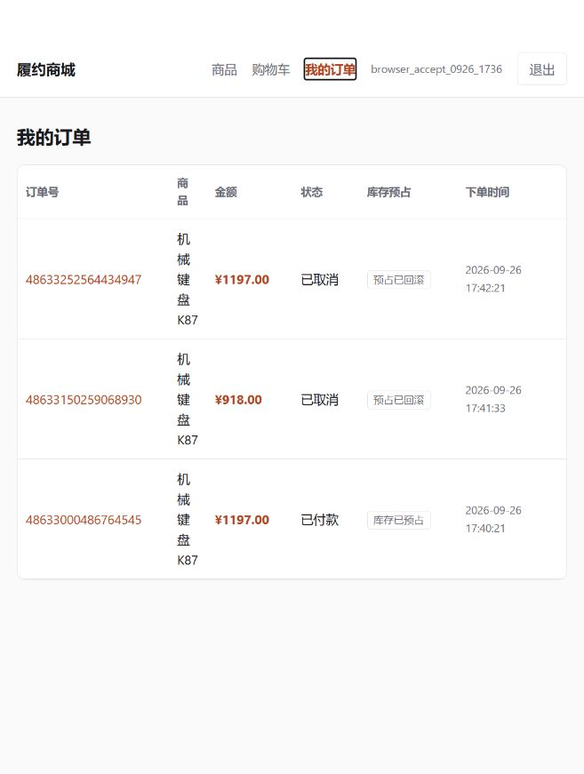

# 本地部署与真实浏览器主链验收（2026-09-26）

## 结论与范围

**PASS：本机隔离部署、三条消费者浏览器交易闭环、接口回归和小规模并发正确性冒烟。完整验收计划尚未全部完成，不代表生产可用。**

本轮使用 Codex 内置浏览器实际填写注册表单、浏览商品、选择规格/数量、加入购物车、结算、模拟支付、主动取消和刷新超时订单。没有用直接写库或浏览器注入接口调用代替页面业务操作。数据库 SQL 只用于专用环境初始化与只读核验。

源码基线：`cac9236c92cf3a0550d047bddf0d6fe19481af9a` 加本轮未提交改动；未 commit、未 push。保留原有 `tutorial.md`、导学和面经。

运行入口：<http://127.0.0.1:5173>。五个后端和依赖在交付时保留运行，仅绑定本机回环地址。前端是 Vite 开发服务器，不是生产 Nginx 部署。可重复操作见 [启动与验收说明](../scripts/acceptance/README.md)。

## 1. 环境与隔离

| 项目 | 实测事实 |
| --- | --- |
| Java / Maven | Temurin 17.0.20.1 / Maven 3.9.11；工具包下载后校验 SHA256 / SHA512；未替换系统 Java |
| 前端 | Node 22.19.0、pnpm 11.19.0，按原锁文件安装与构建 |
| MySQL | 专用 `mysql:8.0.46` 容器，`127.0.0.1:13306`；未停止/重建现有 3306 Windows MySQL |
| Redis | 专用 `redis:7.4-alpine` 容器，`127.0.0.1:16379`，独立数据卷 |
| 后端 | Gateway 18080、Order 18081、Inventory 18082、Payment 18083、Commerce 18084；均只监听 `127.0.0.1` |
| 数据所有权 | 三套业务 schema 与独立账号；Commerce 包含购物车删除权限；业务服务没有跨 schema 权限 |
| 凭证 | 随机生成；本机当前用户 DPAPI 加密保存到 Git 忽略目录；不进入本报告或证据文件 |
| 演示超时 | Commerce 明确配置 180 秒，进入每笔 Order 的持久化截止时间；未改写订单时间或库存以加速验收 |

从空的专用实例顺序完成全部初始化。再次运行初始化返回“指纹一致、未重放 schema 与种子”，没有覆盖已经产生的交易记录。

## 2. 本轮修复

| 问题 | 最小修复与证据 |
| --- | --- |
| 旧消费者下单可以绕过 Commerce 身份/价格校验 | Gateway 默认拒绝旧创建 POST，保留受控实验开关；商城仅经购物车结算。两个旧入口实际请求返回 403；查询、取消、模拟支付仍正常 |
| Java Long 订单号在浏览器 JSON 数字中丢精度 | 6 个浏览器可见响应模型的 `orderId` 改为 JSON 字符串，Java/数据库 Long 不变；新增 8 个序列化用例及现有断言适配；真实页面、URL、支付流水、数据库一致 |
| 前端包管理配置仍是占位文本 | `pnpm-workspace.yaml` 中 esbuild 构建许可改为布尔值，冻结锁文件安装与最终构建通过 |
| 真实浏览器注册失败，但无 Origin 的 API 回归成功 | 复现 `127.0.0.1:5173` 来源请求返回 403 `Invalid CORS request`；验收启动配置显式允许两个本机前端来源，重启 Commerce 后无效表单返回正常 400、真实注册成功；未使用通配来源 |
| PowerShell 日期反序列化导致安全停止误拒绝 | 同一 PID/路径/时间在 PS 7.6 被读为 DateTime，字符串比较误判；改为 UTC ticks，补 8 项只读进程归属测试，错误路径/时间继续拒绝 |
| 购物车选择行数被标成商品件数 | “已选 N 件”改为“已选 N 项”；行内数量和合计不变，浏览器已核验 1 项、3 件、1197 元 |

停止/重启脚本只管理登记且 PID、启动时间、可执行路径匹配的自身进程，不使用全局结束 Java 或清库操作。配置变化、同路径重新打包需先显式停止对应自身服务再启动。

## 3. 构建与自动回归

| 验证 | 结果 | 证据 |
| --- | --- | --- |
| `mvn -B -f microservices/pom.xml package`，Java 17 | 145 tests，0 failures、0 errors、0 skipped；所有模块打包成功 | [JUnit 摘要](evidence/acceptance-2026-09-26/maven-test-summary.json) |
| `pnpm install --frozen-lockfile` + 最终 `pnpm build` | PASS，最终 Vue/Vite 产物构建成功 | 本轮命令输出；未提交 node_modules/dist |
| `test-process-ownership.ps1` | 8/8 PASS | 字符串、UTC/本地 DateTime、JSON 往返匹配；错误时间/路径拒绝 |
| `test-commerce-api.ps1` | 66 项断言 PASS | [脱敏 API 结果](evidence/acceptance-2026-09-26/commerce-api.json) |
| `test-concurrency.ps1` | 38 项断言 PASS | [脱敏并发结果](evidence/acceptance-2026-09-26/concurrency.json) |
| 最终只读数据库断言 | PASS，没有未付款单、残留库存锁或未发送支付事件 | [最终数据库快照](evidence/acceptance-2026-09-26/state-verification.json) |

API 回归覆盖注册/登录、商品查询、购物车、金额不匹配、同键重放、同键异金额冲突、重复支付、重复取消、已支付不可取消、已取消不可支付、其他用户不能读/支付/取消、列表归属及结算后购物车清空。

并发批次同时发起 10 个相同幂等键结算请求，全部返回同一订单 `48632879122481152`，其中 1 次非重放、9 次重放；用户订单列表只有 1 笔。随后同订单支付与取消同时发起，本次取消 200、支付 409，最终 `CANCELED + COMPENSATED`，只释放 1 件。这里只是一次小规模正确性冒烟，没有测吞吐、P99 或大促容量，也不代替真实 MySQL 反向锁死锁专项。

## 4. 三条真实浏览器闭环

合成账号为 `browser_accept_0926_1736`，没有使用用户私人账号。所有支付均为本地模拟，无真实扣款。

| 分支 | 精确订单号 | SKU / 数量 / 金额 | 页面与数据库最终结果 |
| --- | --- | --- | --- |
| A：支付 | `48633000486764545` | 1001 / 3 件 / 1197.00 | 页面已付款；Order `PAID`；流水 `MOCK-48633000486764545`；库存锁 `CONFIRMED` 3 件；支付事件 `SENT` |
| B：主动取消 | `48633150259068930` | 1002 / 2 件 / 918.00 | 页面已取消、预占已回滚；Order `CANCELED + COMPENSATED`；库存锁 `RELEASED` 2 件 |
| C：超时 + Order 重启 | `48633252564434947` | 1001 / 3 件 / 1197.00 | 保持未支付；Order 重启后到期自动取消；页面刷新见已取消，数据库 `COMPENSATED`，完整释放 3 件 |

C 于本机时间 17:42:21 创建，持久化截止为 17:45:21。17:42:36 的数据库快照仍为待付款、锁定 3 件，随后仅停止登记的 Order PID 79344，并以新 PID 89636 启动。没有重发创建、支付或取消请求；17:45:28 的只读检查已看到自动取消及全部释放。该证据覆盖**已成功预占的持久化到期订单**，不覆盖创建过程中的 `RESERVING` 悬挂恢复。

当前页面不自动轮询订单状态，超时后是刷新页面查看终态；不应把这一点写成实时推送。支付后 Order 的 `reservationStatus` 仍为 `RESERVED`，它表示创建阶段预占结果，不是库存锁的最终消费状态；支付实扣依据 Inventory 的 `CONFIRMED` 锁与已发送 Outbox 验证。

页面证据：[支付成功](evidence/acceptance-2026-09-26/browser-paid.png)、[主动取消](evidence/acceptance-2026-09-26/browser-canceled.png)、[超时前](evidence/acceptance-2026-09-26/browser-timeout-pending.png)、[超时后](evidence/acceptance-2026-09-26/browser-timeout-canceled.png)。

## 5. 最终库存核对

五个种子 SKU 初始均为 100 件，期间没有补货或人工调整。

| SKU | 最终可售 | 最终锁定 | 本轮累计确认 | 本轮累计释放 | 守恒 |
| --- | --- | --- | --- | --- | --- |
| 1001 | 97 | 0 | 3 | 3 | 97 + 0 + 3 = 100 |
| 1002 | 100 | 0 | 0 | 2 | 100 + 0 + 0 = 100 |
| 1003 | 100 | 0 | 0 | 0 | 100 |
| 1004 | 100 | 0 | 0 | 0 | 100 |
| 1005 | 99 | 0 | 1 | 2 | 99 + 0 + 1 = 100 |

1005 的交易来自独立 API 与并发测试账号，不与页面账号混淆。最终共 6 笔订单：2 笔支付、4 笔取消；2 条支付 Outbox 均为已发送，没有重复支付新增事件。释放量已经返回可售，不应在守恒公式里重复累加。

五个服务 `/actuator/health` 均 `UP`，各自 `/actuator/prometheus` 均返回 200。这里只验证指标暴露，未启动 Prometheus/Grafana，也未完成业务告警与积压恢复验证。

## 6. 未执行与后续门槛

- NOT_RUN：根目录单体的真实数据库并发/死锁回归、扩大库存竞争规模、所有计划负面用例。
- NOT_RUN：Inventory/Redis 中断下的 Outbox 重试、死信重驱、Redis 命令租约与重启专项、混合路径对账、多实例陈旧执行者。
- 仍需设计与修复：Commerce 未知结果的可靠关联/自动恢复、普通订单停在 `RESERVING` 的恢复、死信受控重驱等，见根目录计划 R03–R06。
- 不在本轮范围：云服务器部署、TLS/公网、真实支付、发货物流、退款、多实例高可用与容量结论。

因此本轮结论是“**已部署且消费者交易闭环真实跑通**”，不是“所有验收项通过”或“已完成生产化”。运行时数据和本机加密配置保留，未清理数据库或数据卷，便于继续核验。
