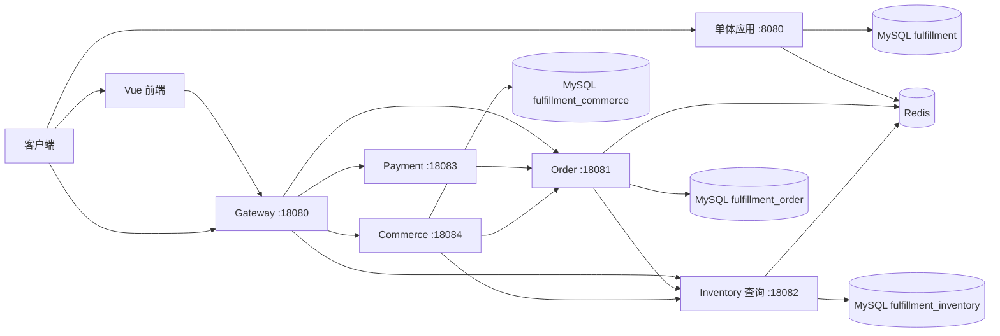

# 项目功能边界与对外口径

> 更新日期：2026-09-26
> 本文是当前仓库功能边界的唯一事实入口。规划目标以 [`project-plan-v3.1.md`](project-plan-v3.1.md) 为准，完成状态以源码、自动化测试和 `docs` 下的验收证据为准。
> 本轮消费者入口隔离、订单号传输修正已在隔离本地部署与三条真实浏览器主链中验证，见 [本轮证据](local-browser-acceptance-2026-09-26.md)。完整验收计划未全部执行；历史测试数量和运行结果保留原口径，不代表本轮重跑。
>
> 同日继续完成 R03/R04 恢复和购物车并发清理，并补 R05 租约/受控重驱实现；前一轮 252 项 Maven 测试、52 条真实故障断言及浏览器未知结果恢复见 [可靠性专项](reliability-recovery-2026-09-26.md)。后续实际死信重驱、确认后发布器中断及账号切换保护见 [闭环补验](closure-acceptance-2026-09-26.md)；多实例租约竞争仍未验收。

## 1. 当前有两条运行路径

- **根目录单体**：周期 0–6 的完整实验与回归基线，覆盖超时关单、Redis 快速下单、异步落库、对账、限流和业务看板。
- **`microservices` 运行切片**：周期 7–12 的四进程交易链路验证 Gateway、Feign、Saga 补偿、Outbox、超时关单和数据所有权；V2 MVP 加入 Commerce，形成五进程商品到支付回调链路。
- 根目录单体继续使用 `fulfillment`；微服务 Order 和 Inventory 分别使用 `fulfillment_order`、`fulfillment_inventory`。三个 schema 当前位于同一个 MySQL 实例。

## 2. 功能矩阵

| 能力 | 根目录单体 | 微服务切片 | 当前结论 |
|---|---|---|---|
| MySQL 下单与多 SKU 预占 | 已实现；订单与库存处于同一本地事务 | 已实现；Order 保存状态后通过 Feign 调 Inventory | 两条路径都有，事务语义不同 |
| 库存预占、释放、确认、查询 | 已实现 | 已实现；变更接口仅在 `/internal/**` | 已覆盖 |
| 支付回调与幂等 | 已实现 | 已实现；增加 HMAC、时间窗和内部令牌 | 已覆盖 |
| 支付成功 Outbox | 本地调用 Inventory，至少一次投递 | Feign 调 Inventory，最多重试 10 次后进入死信 | 已覆盖；不等于 exactly-once |
| 超时关单与库存释放 | Redisson 延迟队列、重试和死信 | 周期 9 已实现持久化到期扫描与补偿释放 | 两条路径都有，调度机制不同 |
| Redis Lua 快速下单 | 已实现 | 周期 10 已实现；Order 持久化命令，Inventory 执行 Lua | 两条路径都有 |
| 异步订单落库与死信补偿 | 已实现 | 周期 10 已实现租约、重试和补偿终态 | 两条路径都有，状态表不同 |
| Redis/MySQL 库存对账 | 已实现 | 周期 10 已实现只读差异报告 | 两条路径都有，不自动修复 |
| 双层令牌桶限流 | 已实现，默认关闭 | 未迁移 | 单体独有 |
| 业务看板与自定义指标 | 已实现 | 周期 12 已有订单与库存业务指标，Grafana 仍以本机静态目标运行 | 看板能力范围不同 |
| Gateway 与 Feign 契约 | 无远程调用 | 已实现 | 微服务独有 |
| 库存取消栅栏 | 无 | 已实现，阻止晚到预占 | 微服务独有 |
| 订单查询接口 | 未提供 Controller | `GET /api/orders/{id}` | 微服务独有 |
| `order_item` 明细持久化 | 未实现 | 周期 8 已实现，与订单主表同一本地事务 | 微服务已覆盖 |
| 订单创建请求幂等 | 未实现 | 周期 8 已实现，同载荷重放、异载荷冲突 | 微服务已覆盖 |
| 商品、用户、购物车与结算 | 未实现 | V2 MVP 在 Commerce 已实现；商品快照随订单写入 Order | 本机主链路已验收 |
| 主动取消与模拟支付 | 未实现 | 订单详情可取消待支付订单并触发库存补偿；Payment 提供本人订单的本地模拟支付 | 五进程 HTTP 已验收；不产生真实扣款 |
| 网关 JWT 与订单直连防护 | 未实现 | V2 MVP 已实现；Order 的 `/api/orders/**` 要求内部令牌 | 本机验证伪造直连请求为 401 |
| 消费者结算与实验创建隔离 | 不作为商城入口 | 消费者走 Commerce；Gateway 默认拒绝旧普通/Redis 创建 POST，受控实验可显式开启 | 本轮实测旧入口 403，消费者浏览器结算正常 |
| 浏览器长订单号传输 | 保留旧实验契约 | 微服务浏览器响应的非空 `orderId` 为 JSON 字符串；内部 Java/SQL 类型不变 | 本轮页面、URL、支付流水与数据库订单号一致 |
| Nacos 服务发现与配置 | 未实现 | 未实现，使用固定 URL 环境变量 | 后续项 |
| 独立数据库/schema/账号 | 未实现 | Order、Inventory、Commerce 各有独立 schema 和应用账号 | 已形成数据所有权边界；仍共用 MySQL 实例 |

## 3. 服务和数据所有权

| 进程/模块 | 默认端口 | 当前职责 | 实际访问的数据 |
|---|---:|---|---|
| `gateway` | 18080 | 对外路由 | 不访问数据库 |
| `order-service` | 18081 | 创建订单、预占状态、支付状态、Outbox、Redis 命令与补偿调度 | `order`、`order_item`、`order_outbox_event`、`microservice_order_command` |
| `inventory-service` | 18082 | 库存预占、释放、确认、Redis 原子预扣、查询、对账和取消栅栏 | `sku_stock`、`sku_stock_lock`、`inventory_reservation_fence`、`inventory_redis_reservation` |
| `payment-service` | 18083 | 校验支付回调并调用 Order | 不访问数据库 |
| `commerce-service` | 18084 | 用户、商品、购物车、结算幂等与价格快照 | `fulfillment_commerce` 中的用户、商品、购物车和结算记录 |
| `fulfillment-api` | - | DTO 与 Feign 契约 | 不包含实体或 Mapper |

这已经形成代码、进程、本地事务、schema 和账号边界。三个业务 schema 仍部署在同一 MySQL 实例，服务发现、多实例验证和生产运维体系尚未完成，因此当前仍称为**本地微服务运行切片**。

## 4. 一致性语义

### 单体路径

- 创建订单和库存预占在同一个 MySQL 本地事务中提交或回滚。
- 超时取消与库存释放在同一个 MySQL 本地事务中完成。
- 支付状态与 `PAYMENT_CONFIRMED` 事件在同一本地事务中写入。
- Outbox 在事务外投递，库存确认依靠状态条件更新吸收重复调用。
- Redis 预扣与 MySQL 落库之间没有分布式事务；已记录命令的失败路径可重试或补偿，对账用于发现仍未收敛的差异，不会自动修正。

### 微服务路径

- 商城消费者通过 Commerce `POST /api/checkout` 结算，由可信身份和服务端商品价格构造内部订单请求；旧 `POST /api/orders`、`POST /api/orders/redis` 默认经 Gateway 返回 403。`GATEWAY_LEGACY_ORDER_CREATE_ENABLED=true` 仅限受控本地实验，仍要求 JWT，但开关不是请求体用户/价格授权。本人订单查询、取消及正常结算不依赖此开关。
- 结算、订单列表/详情、取消、支付及实验创建响应中的非空 `orderId` 使用 JSON 字符串，未知结果中的 `null` 保留；前端不得转为 JavaScript `Number`。内部 Java `long`/`Long` 和数据库类型不变，未扩大为全部整数类型的全局序列化变更。
- Order 与 Inventory 各自提交本地事务，不共享 `@Transactional`。
- 下单使用 `RESERVING → RESERVED / FAILED / PENDING_COMPENSATION / COMPENSATED` 状态推进；未知远程结果通过释放和后台补偿收敛。
- Inventory 使用 `orderId + skuId` 唯一约束、条件状态更新和取消栅栏保证接口幂等并处理释放早于预占的竞态。预占、释放、确认三个本地事务显式使用 READ_COMMITTED，消除本轮实测的缺行范围间隙锁插入循环；仍先锁订单栅栏、当前读锁记录并按 SKU 升序更新，不修改全局隔离级别，也不声称消除全部死锁。
- 支付状态与 Outbox 在 Order 的本地事务中提交，发布器通过 Feign 至少一次调用 Inventory；每次领取独立 owner/60 秒租约，写回要求 owner 匹配且未过期。连续失败 10 次进入死信；专用本地审计重驱脚本默认预览、显式执行只重新排队。本轮已实测默认退避至 DEAD、受控重驱和最终 SENT/库存确认，不能只凭重排成功判断业务完成。
- Commerce 在远程调用前固定原订单号和完整结算快照；同键读取原意图，恢复超出创建窗口后只读核对。NOT_FOUND、未知及补偿中不能直接算失败；缺历史快照或超过自动次数转人工。购物车清理使用原行 ID + revision CAS，恢复不清车，失败保留明确提示。
- 普通陈旧 RESERVING 默认 60 秒后取消补偿，查询与 CAS 都排除 Redis 命令订单；取消决策提交后才释放，未赢得 CAS 的迟到异常不能释放有效预占。
- Redis 快速路径先持久化 Order 命令，再由 Inventory Lua 原子预扣；后台租约任务创建 MySQL 订单，失败时用载荷签名和取消墓碑幂等补偿。
- Inventory 自有账本记录 `PENDING / MATERIALIZED / COMPENSATED`；对账公式为 `MySQL 可售库存 - PENDING 账本预扣量`，不读取 Order 命令表，当前只输出差异，不自动改数。
- Redis 预扣与 MySQL 账本不是一个事务。账本写入失败时 Order 命令保持可恢复状态，重试 Redis 会命中幂等标记并补写账本。订单已经落库后，账本物化失败只重试投影，禁止走 Redis 回补。

## 5. 证据等级与可用表述

### 本轮已验证范围与未执行项

- [隔离验收脚本](../scripts/acceptance/README.md) 已完成专用依赖与五个本机后端部署，MySQL/Redis 端口为 `13306`/`16379`，没有重置已有实例；前端为 Vite 开发服务器，不是生产 Nginx 部署。
- 本轮工具链使用新发现的 JDK 17 与 Maven 3.9.11 路径；旧 `run-tests.ps1` 硬编码路径当前失效，未在本轮修改单体测试入口。具体路径与执行限制见根目录 README。
- [本轮独立证据](local-browser-acceptance-2026-09-26.md) 分别记录：145 项 Maven 测试通过、66 项 API 回归断言通过、38 项小规模并发断言通过，不合并声称全量验收或容量结果。
- 三条真实浏览器主链为模拟支付、主动取消、Order 重启后的持久化到期取消；均核对最终订单、库存锁与相关 Outbox，长订单号保持精确。超时状态需要刷新页面查看，不是实时推送；重启场景只覆盖已成功预占订单，不覆盖创建中的 `RESERVING` 恢复。
- 上述首轮之后，可靠性专项已实测 Commerce 丢响应/重启恢复、普通订单在预占前/后中断自动补偿、三种购物车并发编辑及 Outbox 503 后重试；52 条断言通过。252 项 Maven 测试通过，66 条 API/38 条并发断言重新执行通过，另完成浏览器改车/刷新后找回原单。
- 同日补验已执行真实死信重驱、确认已完成但发布器未标发送时中断、取消释放失败后恢复、浏览器未知结果下的账号切换与安全负面用例；结果与并发库存修复的前后对照见 [闭环补验](closure-acceptance-2026-09-26.md)。历史报告中的未运行项表示当时状态，不覆盖本轮新增证据。
- 完整计划未全部执行：多实例租约竞争、单体并发/死锁、Redis 命令恢复、混合路径对账及商品改名改价后的历史快照核查 B04 等仍未重跑。不能宣称全部 P0/P1 通过或生产可用。

### 已有真实运行证据

- 周期 1：同配置并发实验中，先查后扣出现超卖，原子条件更新超卖为 0。
- 周期 2：真实 Redis 链路中，2 秒超时订单自动取消并完整释放 3 件锁定库存。
- 周期 4：40 个未排序事务出现 20 个死锁回滚；统一按 `skuId` 排序后，同轮 40 个事务无死锁回滚。
- 周期 5：单机三轮 JMeter 对比中，MySQL 路径中位吞吐 113.30 req/s，Redis 接受路径 342.91 req/s。Redis 的 HTTP 202 只表示命令被可靠接受。
- 周期 6：根目录单体的 Prometheus 采集目标为 `UP`，Grafana 数据源和看板可加载。
- 周期 7：本机四进程、共享 MySQL、固定 URL 条件下，完成下单、支付、重复回调、库存确认和库存服务宕机后的补偿联调。
- 周期 8：相同订单载荷重放不重复扣库存，异载荷返回冲突，订单明细完整持久化。
- 周期 9：2 秒未支付订单约 2.64 秒完成取消和库存释放，支付成功订单不会被到期扫描覆盖。
- 周期 10：真实 Gateway Redis 下单完成命令持久化、Lua 预扣和异步订单创建；30 秒到期后 MySQL 与 Redis 均恢复到 20，锁记录进入已释放，对账不再报告该 SKU。
- 周期 11：双 schema 与最小权限账号下，真实 Gateway Redis 下单完成预扣、异步落库和账本物化；3 秒到期后订单、MySQL 库存、Redis 库存和 Inventory 账本全部收敛，目标 SKU 对账无差异。
- V2 MVP：本机五进程完成匿名浏览、注册、购物车、结算同键重放、订单查询、模拟支付及库存确认；微服务 109 项测试和单体 47 项回归通过。

### 对外必须带上的限定

- “防超卖”限定为当前原子 SQL 和实测并发条件，不能外推为任意容量下都无问题。
- “死锁降为 0”限定为本次反向双 SKU 实验，不能描述为彻底消除所有数据库死锁。
- 历史周期 7–11 的微服务证据分别按当期共享库/双 schema、四进程口径解读；2026-09-26 的商城主链证据为本机五进程、三套业务 schema、固定 URL。两者都不代表多实例或生产高可用验收。
- “Outbox 可靠投递”应表述为本地事务落库、至少一次投递、幂等消费、有限重试和死信。
- “安全加固”限定为共享内部令牌、支付 HMAC 和五分钟时间窗；不等于生产身份体系。
- 周期 11 的 44 项测试覆盖服务层、Controller、Feign 契约、Gateway 路由、Redis 幂等、Inventory 账本与异步命令状态机；真实跨进程结果来自单机联调记录。

### 当前不能声称已完成

- 生产级高可用、多实例无重复、零数据丢失或自动容灾。
- Nacos、负载均衡、灰度发布、Seata、RocketMQ 或 MySQL 实例级拆分。
- TLS、密钥轮换、生产级服务身份、细粒度授权和防重放存储。V2 入口已有 JWT；Order 公共路由已有内部令牌，但不等于完整身份体系。
- 微服务全量 Prometheus/Grafana、分布式追踪、集中日志、告警和 SLO。
- 周期 12 已完成四个微服务 Prometheus 指标端点与静态抓取配置；多实例告警、分布式追踪、集中日志和 SLO 仍未完成。
- 微服务容量结论；周期 5 的数据来自单机短时单体路径。
- 双层令牌桶和业务看板已经迁入微服务。
- 根目录单体的 `order_item` 已持久化或普通 MySQL 下单接口已经幂等。

## 6. 里程碑命名

所有当前说明统一使用“周期 0–11”，与规划书顺序对应：

- **周期 0**：环境与工程骨架。
- **周期 1**：超卖复现与原子扣减；早期文档曾简称 M0。
- **周期 2**：库存三态与超时关单；早期文档曾简称 M1。
- **周期 3**：单体业务边界、支付幂等和 Outbox。
- **周期 4**：多 SKU 死锁复现与排序修复。
- **周期 5**：Redis 预扣、异步落库、对账、限流和压测。
- **周期 6**：可观测性和运行看板。
- **周期 7**：在原规划之外追加的微服务运行切片。
- **周期 8**：微服务订单创建幂等与订单明细持久化。
- **周期 9**：微服务持久化超时关单与库存补偿释放。
- **周期 10**：微服务 Redis 快速下单、可靠异步落库与库存对账。
- **周期 11**：Order / Inventory schema、账号与对账数据所有权隔离。
- **周期 12**：微服务 Prometheus 指标与运行恢复信号。

“完成”默认只表示实现、自动化测试和对应验收证据完成；不包含规划书要求的个人面试盘问，也不代表生产就绪。

## 7. 下一阶段边界

建议按以下顺序推进：

1. 接入服务发现，并补多实例 Outbox 和真实故障注入。
2. 为 Inventory 账本投影增加告警与受保护的人工恢复入口。
3. 评估双层令牌桶和业务看板是否迁移，先定义微服务容量与运维验收指标。

## 8. 证据索引

- [2026-09-26 本地部署与浏览器验收](local-browser-acceptance-2026-09-26.md)
- [本地隔离部署与验收脚本说明](../scripts/acceptance/README.md)
- `docs/cycle4-evidence-2026-09-19.md`
- `docs/redis-timeout-e2e-2026-09-19.md`
- `docs/cycle5-evidence-2026-09-19.md`
- `docs/cycle6-observability-2026-09-19.md`
- `docs/cycle7-microservices-evidence-2026-09-21.md`
- `docs/cycle8-order-idempotency-evidence-2026-09-21.md`
- `docs/cycle9-timeout-close-evidence-2026-09-21.md`
- `docs/cycle10-redis-microservice-evidence-2026-09-21.md`
- `docs/cycle11-schema-isolation-evidence-2026-09-21.md`
- `docs/cycle12-observability-evidence-2026-09-21.md`
- `docs/mvp-v2-test-evidence-2026-09-24.md`
- `docs/audit-remediation-2026-09-19.md`
